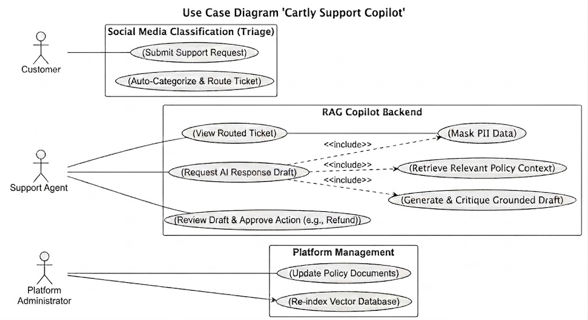
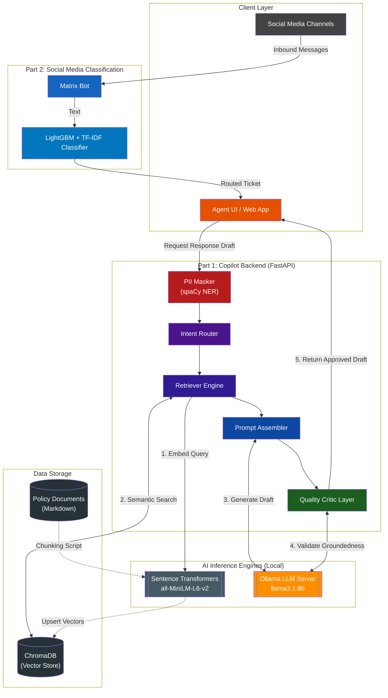
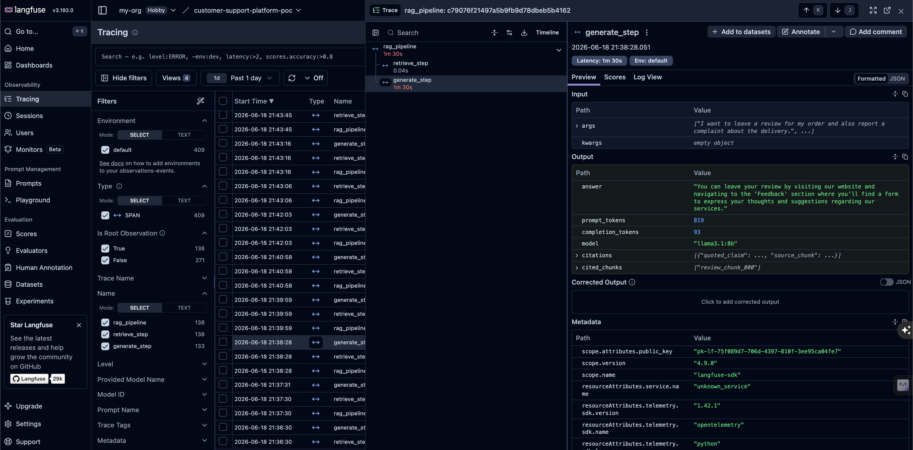

# Cartly Support Copilot — Autonomous Support Platform POC


## Goal of the Project

The goal of this project is to scope, design, and de-risk the **Cartly Support Copilot**, an agentic AI customer support system.

Specifically, this project aims to:
- **Contract System Performance**: Define what "good" performance looks like in numbers (KPIs, success metrics) and draft a concrete Product Requirements Document (PRD) and Technical Design Document.
- **De-risk the Highest Assumption**: Prove that the hardest part of the system (retrieval of policy documents) is highly accurate by building a Python retrieval spike using ChromaDB, comparing different chunking strategies, and establishing retrieval hit-rate metrics.

---

## System Architecture & Integration Plan

The platform is designed around two distinct but complementary pipelines. You can view the complete, end-to-end architecture diagram detailing both pipelines below (or in the [Technical Design Document](docs/TECHNICAL_DESIGN.md#1-architecture-overview)).

### Use Case Diagram


### Architecture Diagram




### 1. Classification Pipeline (Social Media Triage)
A fast, lightweight, and GPU-free machine learning pipeline (TF-IDF + LightGBM). It automatically ingests inbound messages from social media channels (via Matrix), cleans the text, and classifies the intent and category (e.g., Refund, Technical Support). 

### 2. RAG Copilot Backend
A Retrieval-Augmented Generation pipeline using local LLMs (Ollama) and Vector Search (ChromaDB). It takes a classified ticket, retrieves relevant Markdown policies, and synthesizes a highly grounded, citable draft response for the support agent. It also features a "Quality Critic" layer that evaluates the draft against hallucinations before it's ever shown to the agent.

### Future Integration
Currently, these two pipelines operate independently as proof-of-concept endpoints. In the future, they will be tightly integrated:
1. The **Classification Pipeline** will intercept raw social media messages in real-time, tag them with an intent, and automatically route them to department-specific Agent rooms in the Matrix client.
2. Once routed, an Agent opening the ticket will automatically trigger the **RAG Copilot Backend**.
3. The Copilot will read the ticket, retrieve the relevant policy context, and present a pre-written, highly accurate "Pending Approval" draft in the Agent UI, drastically reducing the time it takes to resolve the ticket.

## Observability (Langfuse Tracing)

The entire pipeline is instrumented with [Langfuse](https://langfuse.com/) for full observability. Every inference call, token usage, latency metric, and retrieved context chunk is traced and logged in real-time, allowing developers to inspect the exact prompt assembly and groundedness evaluation for any ticket.




---

## Setup and Run

This project uses [uv](https://docs.astral.sh/uv/) for dependency management. No manual virtual environment activation is needed.

### 1. Run the Setup Automation Script

This script installs all dependencies, sets up conventional commit and black formatting Git hooks, and generates the policy dataset:

```bash
# Make the setup script executable (only needed once)
chmod +x setup.sh

# Run the setup script
./setup.sh
```

### 2. Running Scripts

Once setup is complete, run any script with `uv run`:

```bash
# Generate policy dataset
uv run python scripts/process_hf_dataset.py

# Run the Matrix CLI
uv run python main.py --help

# Run data ingestion
uv run python scripts/databricks_ingest.py
```

### 3. Testing the System

You can manually test the various components of the system using the following commands:

#### Intent Classification & Spike Tests
```bash
# 1. Generate the policy dataset
uv run python scripts/process_hf_dataset.py

# 2. Train the intent classification model
uv run python scripts/train.py

# 3. Test classification inference
uv run python scripts/score.py "I need a refund for my order"

# 4. Evaluate typo robustness (generates FINDINGS.md)
uv run python spike/evaluate_typos.py

# 5. Run the retrieval de-risk spike (outputs hit rate)
uv run python spike/retrieval_spike.py

# 6. Test the Matrix Client CLI
uv run python main.py --help
```

#### RAG Pipeline & Evaluation Tests
```bash
# 7. Ingest policies into ChromaDB
uv run python app/ingest.py

# 8. Test RAG Retrieval (standalone)
uv run python app/retrieve.py "How do I return an item?"

# 9. Test RAG Generation (standalone smoke test)
uv run python app/generate.py

# 10. Run 50-question Ragas Golden Evaluation Scorecard (generates eval/scorecard.md)
uv run python eval/evaluate.py

# 11. Run RAG Pipeline Experiments
uv run python experiments/exp1_top_k.py

uv run python experiments/exp2_chunk_size.py

uv run python experiments/exp3_system_prompt.py
```

---

### Manual Setup (Alternative)

If you prefer to set up components individually:

#### 1. Install Dependencies
```bash
uv sync
```

#### 2. Git Hooks Setup
```bash
cp githooks/pre-commit .git/hooks/pre-commit
cp githooks/commit-msg .git/hooks/commit-msg
chmod +x .git/hooks/pre-commit .git/hooks/commit-msg
```

#### 3. Data Corpus Generation

```bash
uv run python scripts/process_hf_dataset.py
```
This will extract unique intents and save them as Markdown documents in `/data/policies/`.

---

## Matrix Client (Messaging Integration)

This repository also includes a lightweight CLI tool and ingestion script that interface with the Matrix.org (Element) communications protocol for bidirectional messaging and data ingestion.

### Components

**Matrix Client CLI (`main.py`)**
A command-line interface to interact directly with Matrix rooms:
- List joined rooms and pending invites
- View recent messages, including automatic downloading of media attachments
- Send messages and reply directly to specific events
- Join new rooms by alias or ID

**Databricks Ingestion Script (`scripts/databricks_ingest.py`)**
A stateful ingestion script designed to extract messages for downstream processing (e.g., Databricks pipelines):
- Syncs and tracks new messages using Matrix synchronization tokens
- Resolves message threads and recipient information for replies
- Generates structured JSON payloads of extracted conversation data

### Configuration

Create a `.env` file in the root directory with your credentials:
```env
ACCESS_TOKEN="your_matrix_access_token_here"
MATRIX_ROOM_ID="!your_room_id:matrix.org"
```

Install and run:
```bash
uv sync

# Matrix CLI
uv run python main.py --help

# Data Ingestion
uv run python scripts/databricks_ingest.py
```
---

## Key Documents

| Document | Location | Purpose |
|---|---|---|
| Product Requirements Document | [docs/PRD.md](docs/PRD.md) | Problem statement, KPIs, functional requirements |
| Technical Design | [docs/TECHNICAL_DESIGN.md](docs/TECHNICAL_DESIGN.md) | Architecture for the RAG copilot (Part 1) and classification pipeline (Part 2) |
| Risk Register | [docs/RISK_REGISTER.md](docs/RISK_REGISTER.md) | Risks for the Copilot (Part 1) and classification pipeline (Part 2) |
| LLM Red-Team Evaluation | [docs/LLM_REDTEAM.md](docs/LLM_REDTEAM.md) | KPI critique and revised definitions |
| LLM Red-Team Pass/Fail Gate | [docs/LLM_GATE.md](docs/LLM_GATE.md) | Failing case diagnosis and prompt-based mitigation |
| Executive Memo | [docs/EXEC_MEMO.md](docs/EXEC_MEMO.md) | Comprehensive Stakeholder memos: Phase 2 Evaluation Scorecard & Phase 1 AI Investment Case |
| Retrieval Spike Findings | [spike/FINDINGS.md](spike/FINDINGS.md) | Chunking strategy comparison and retrieval hit-rate results |
| Typo Robustness Findings | [docs/FINDINGS.md](docs/FINDINGS.md) | TF-IDF / BM25 robustness evaluation across three experiments |
| Project Reflections | [docs/REFLECTION.md](docs/REFLECTION.md) | Week 15 and Week 16 reflections on KPIs, assumptions, constraints, and metrics |

---
