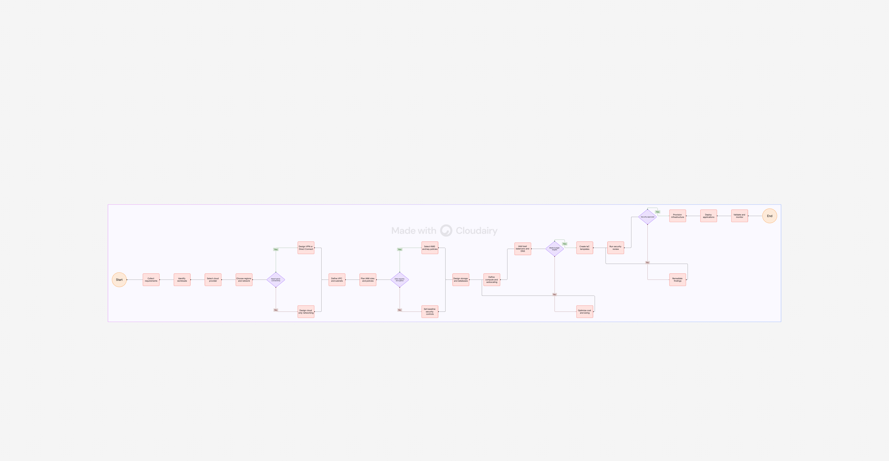
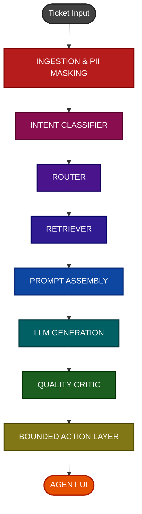

# Technical Design Document
## Cartly Support Copilot - v1.0

**Author:** Niranjan Hebli & Bryson Gracias
**Status:** Draft
**Last Updated:** June 2026

---
## 1. Architecture Overview

The system is a multi-stage RAG (Retrieval-Augmented Generation) pipeline. Every ticket passes through the following sequential stages before a draft response is presented to the agent:



## 2. Sequence Diagram 



---

## 2. Component Breakdown

### 2.1 PII Masker

**Purpose:** Ensure no raw customer data (name, email, order ID, phone number) is ever sent to an LLM provider API.

**Implementation:**
- Pre-processing step runs locally before any API call
- Regex patterns cover email, phone, and order ID formats
- spaCy NER (en_core_web_sm) identifies PERSON entities
- Masked tokens are replaced with typed placeholders: `[EMAIL]`, `[ORDER_ID]`, `[CUSTOMER_NAME]`
- Original values stored in a local session context map for re-insertion into the agent UI display only

**Failure mode:** If masking fails to parse (malformed input), the pipeline halts and returns a human-only fallback before hitting any LLM API.

### 2.2 Intent Classifier

**Purpose:** Classify the ticket into one of 5 intent labels to route it to the correct policy domain.

**Intent Labels:**
- `return_request`
- `refund_request`
- `shipping_inquiry`
- `account_issue`
- `product_question`

**Implementation:**
- Model: llama3.1:8b via local Ollama (zero-shot, no fine-tuning required for V1)
- Prompt: System prompt defines each label with a one-sentence definition. User message is the masked ticket text.
- Output: Structured JSON `{"intent": "refund_request", "confidence": 0.91}`
- Fallback: If confidence is below 0.5, route to `unknown` intent which triggers the human-only fallback path

### 2.3 Router

**Purpose:** Map the classified intent to the set of ChromaDB collections to query.

**Routing Table:**

| Intent | Collections Queried |
|---|---|
| `return_request` | `returns_policy`, `shipping_policy` |
| `refund_request` | `refunds_policy`, `returns_policy` |
| `shipping_inquiry` | `shipping_policy` |
| `account_issue` | `account_policy` |
| `product_question` | `product_faq` |
| `unknown` | Human-only fallback, no retrieval |

### 2.4 Retriever

**Purpose:** Fetch the top-5 semantically relevant policy chunks from ChromaDB.

**Implementation:**
- Embedding model: `all-MiniLM-L6-v2` (sentence-transformers, local, 384-dimensional vectors)
- Vector store: ChromaDB (local persistent store in `/data/chroma_store/`)
- Query: Embedded masked ticket text
- Top-k: 8 chunks per collection queried
- Similarity threshold: Cosine similarity score must be >= 0.6 for a chunk to be included. Chunks below this threshold are excluded from the prompt context.
- Metadata stored per chunk: `doc_name`, `chunk_id`, `indexed_at`, `doc_commit_hash`

**Failure mode:** If zero chunks meet the threshold, the pipeline routes to human-only fallback mode.

### 2.5 Prompt Assembler

**Purpose:** Construct the final generation prompt with grounding context.

**Prompt Structure:**
```
System: You are a support agent assistant for Cartly. Your ONLY job is to draft a
response grounded in the policy clauses provided below. Do not infer, guess, or add
information not present in the retrieved context. If the retrieved context does not
contain a clear answer, output: "I cannot answer this from the available policy."

Retrieved Context:
[Source: returns_policy.md]
<chunk text>

[Source: refunds_policy.md]
<chunk text>

Customer Query:
<masked ticket text>

Draft a concise, professional reply. At the end, cite the source clause used.
```

### 2.6 LLM Generator

**Model:** Local Ollama llama3.1:8b
**Temperature:** 0.0 (zero temperature for consistent, factual outputs)
**Max tokens:** 400 (sufficient for a support reply, prevents runaway generation)
**Output:** Draft reply text + cited chunk reference

**Cost model per 1,000 queries:**

| Component | Tokens per query (est.) | Cost per query | Cost per 1,000 queries |
|---|---|---|---|
| Intent classification | ~300 tokens in + ~20 out | $0.000048 | $0.048 |
| Embedding (retrieval) | ~150 tokens | $0.000003 | $0.003 |
| Draft generation | ~800 tokens in + ~350 out | $0.000184 | $0.184 |
| Quality critic | ~900 tokens in + ~50 out | $0.000095 | $0.095 |
| **Total** | | **~$0.00033** | **~$0.33** |

This is well within the NFR-06 target of less than $2.00 per 1,000 queries.

### 2.7 Quality Critic

**Purpose:** Validate that the generated draft is grounded in the retrieved context and does not hallucinate.

**Implementation:**
- Second LLM call (llama3.1:8b via local Ollama)
- Input: Retrieved chunks + generated draft
- Critic prompt: "Review this draft response. Does it make any claim not explicitly supported by the retrieved policy clauses? Answer in JSON: `{'is_grounded': true/false, 'violation': 'description or null'}`"
- Output: `{"is_grounded": true, "violation": null}` or `{"is_grounded": false, "violation": "Draft mentions 7-day window; policy says 5 days"}`
- If `is_grounded: false` -> pipeline routes to human-only fallback, draft is NOT presented

### 2.8 Bounded Action Layer

**Purpose:** Gate the Refund Approval Draft behind explicit agent confirmation.

**Rules:**
- Refund Approval Draft is only surfaced if: (a) intent is `refund_request`, (b) critic passes, (c) retrieved chunk explicitly authorizes the refund amount/window
- The UI presents the draft as a "Pending Agent Approval" card - the agent must click "Approve and Send" explicitly
- No automated send path exists in V1

### 2.9 Failure Mode Table

| Failure Scenario | System Response |
|---|---|
| PII masking error | Halt pipeline, show human-only mode, log error |
| Intent classifier confidence below 0.5 | Route to human-only fallback, no retrieval |
| Zero chunks meet similarity threshold (0.6) | Show "No relevant policy found" fallback state |
| Quality critic flags hallucination | Suppress draft, show "Low confidence - manual review required" |
| LLM API timeout (>15s) | Return graceful error, show human-only mode, log timeout |
| ChromaDB read failure | Alert on-call, show human-only mode for all tickets until resolved |

---

## 3. Data Contracts (Pydantic Models)

```python
from pydantic import BaseModel
from typing import Optional, List

class TicketInput(BaseModel):
    ticket_id: str
    raw_text: str
    timestamp: str  # ISO 8601

class MaskedTicket(BaseModel):
    ticket_id: str
    masked_text: str
    pii_map: dict  # {"[EMAIL]": "actual@email.com"} - never sent externally

class IntentResult(BaseModel):
    ticket_id: str
    intent: str
    confidence: float

class RetrievedChunk(BaseModel):
    chunk_id: str
    doc_name: str
    text: str
    similarity_score: float
    indexed_at: str

class DraftResponse(BaseModel):
    ticket_id: str
    draft_text: str
    cited_chunks: List[str]  # list of chunk_ids
    is_grounded: bool
    critic_violation: Optional[str]
    intent: str
```

---

## 4. Model Selection Rationale

| Model | Use Case | Rationale |
|---|---|---|
| `all-MiniLM-L6-v2` (sentence-transformers) | Retrieval embedding | Local model, no API cost, 384-dimensional vectors. Chosen for zero-cost local inference and sufficient quality for domain-specific semantic search. |
| `llama3.1:8b` via Ollama | Draft generation | Low latency (Local Ollama inference), free tier sufficient for dev/eval. Instruction-following quality adequate for policy-grounded drafts at low temperature. |
| `en_core_web_sm` (spaCy) | PII NER | Runs locally, no API call required, sufficient for PERSON entity detection in English support tickets |

---

## 5. Deployment and Re-index Plan

### Re-index Trigger
- GitHub Actions webhook fires on any commit that modifies files in `/data/policies/`
- The re-index job runs `scripts/ingest.py`, which re-chunks and re-embeds all policy documents
- Each chunk is stored with `indexed_at` timestamp and `doc_commit_hash` for freshness tracking
- Slack notification sent to `#support-ai-ops` on successful re-index, reporting total document count and index date

### Chunk Age Monitoring
- Weekly automated job checks for chunks with `indexed_at` older than 30 days
- Stale chunks are flagged in a Slack alert for manual review before the next weekly eval

### Infrastructure (V1 - Local)
- ChromaDB runs as a local persistent store (no managed vector DB cost in V1)
- All API calls routed through a lightweight FastAPI backend
- No cloud deployment required for the de-risk spike; local execution is sufficient

---

---

# Part 2 — Classification Pipeline Technical Design
## Social Media Intent Routing (TF-IDF / LightGBM)

**Author:** Niranjan Hebli & Bryson Gracias
**Last Updated:** June 2026

---

## 6. Problem Statement

**Problem + Cost:** Customer support agents are spending ~30% of their time manually reading and triaging inbound Social Media messages to the correct department (e.g., Billing, Tech Support, Refunds). This manual triage costs approximately **$4,500/month** in agent hours and delays first-response times by an average of **45 minutes**.

---

## 7. User Stories

| Persona | User Story |
|---|---|
| Customer | As a customer, I want my support query to reach the correct department immediately so that my issue is resolved faster. |
| Support Agent | As a support agent, I want incoming Social Media messages to be pre-categorized so that I only see tickets relevant to my expertise. |
| Support Manager | As a support manager, I want to see a confidence score for automated routing so I can review low-confidence categorizations. |

---

## 8. Scope

**In Scope:**
- Categorization of English text messages from Social Media
- Predicting Category and Intent
- Filtering out low-confidence (< 0.60) predictions (defaults to `UNDEFINED`)

**Out of Scope:**
- Voice / audio message classification
- Automated ticket resolution (bot replies)
- Multi-lingual support

---

## 9. Requirements

### Functional
- Model must predict Intent and Category from a text string
- Pipeline must fall back to `UNDEFINED` if confidence is below 0.60

### Non-Functional
- Inference latency under 200ms per message
- Model must run locally without cloud GPU dependencies

---

## 10. KPIs

| KPI | Definition | Target | Floor |
|---|---|---|---|
| **Macro F1-Score** | Harmonic mean of precision and recall across all intents | > 0.85 | 0.75 |
| **Intent Match Rate** | % of messages where predicted intent exactly matches human labels | > 90% | 80% |
| **p95 Latency** | Time to run text through TF-IDF and LightGBM inference | < 50ms | < 200ms |
| **Automated Route Rate** | % of inbound Social Media messages successfully categorized (confidence > 0.60) without human intervention | > 75% | 60% |

---

## 11. Pipeline Overview

```
Social Media Message Ingest
    -> Text Cleaning (strip whitespace / newlines)
    -> TF-IDF Vectorization (10k features, English stop words)
    -> LightGBM Classifiers (Category & Intent, trained separately)
    -> Confidence Threshold Filter (< 0.60 defaults to 'UNDEFINED')
    -> Structured JSON Output
```

---

## 12. Data Contracts

### Input Payload (from Matrix Client)

```json
{
  "room_id": "!xyz:matrix.org",
  "event_id": "$abc123def",
  "sender": "@customer:matrix.org",
  "text": "I need help claiming refund for my returned order."
}
```

### Classification Output (`score.py`)

```json
{
  "event_id": "$abc123def",
  "predicted_intent": "refund_request",
  "intent_confidence": 0.8921,
  "predicted_category": "REFUND",
  "category_confidence": 0.9104
}
```

---

## 13. Model Choice Justification

**LightGBM + TF-IDF** was selected over deep learning embeddings (e.g., Transformers) for the following reasons:

| Criterion | LightGBM + TF-IDF | Transformer Embeddings |
|---|---|---|
| GPU required | No | Yes (or slow CPU inference) |
| Local inference latency | < 50ms | 200ms–2s |
| Deployment complexity | Low (single `.pkl` file) | High (model server required) |
| Typo robustness | Low (exact-match) | High (semantic) |
| Training data required | Low (< 1k examples) | High (fine-tuning needed) |

**Verdict for V1:** LightGBM + TF-IDF is the right choice for a lightweight, GPU-free local deployment. Typo robustness is the known tradeoff (see [RISK_REGISTER.md](RISK_REGISTER.md) and [FINDINGS.md](FINDINGS.md)).

---

## 14. Bounded Downstream Action

When classification confidence exceeds 0.60, the Matrix bot performs one of the following bounded actions:

- Appends a colored department tag to the message (e.g., `[ACCOUNT_MANAGEMENT]`)
- Forwards the message event to the corresponding department-specific Matrix room

No automated resolution or reply is sent to the customer. A human agent in the routed room handles the ticket.
