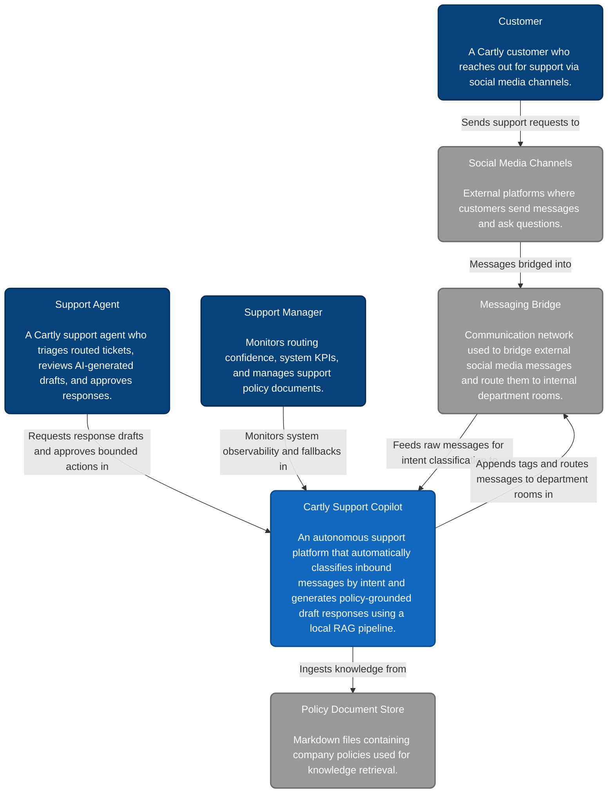

# Cartly Support Copilot - C4 Context Diagram

This document contains the System Context diagram for the Cartly Support Copilot, describing the system's high-level interactions with users and external systems.

