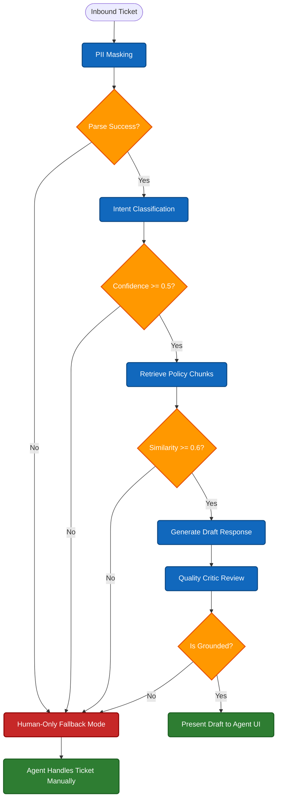

# Cartly Support Copilot - Control Flow Diagram

This document contains the Control Flow diagram, detailing the conditional logic, decision paths, and fallback mechanisms throughout the pipeline.

```mermaid
flowchart TD
    classDef process fill:#1168bd,color:#fff,stroke:#0b4884,stroke-width:2px,rx:5px,ry:5px
    classDef decision fill:#ff9800,color:#fff,stroke:#e65100,stroke-width:2px,rx:5px,ry:5px
    classDef fallback fill:#c62828,color:#fff,stroke:#8e0000,stroke-width:2px,rx:5px,ry:5px
    classDef terminal fill:#2e7d32,color:#fff,stroke:#1b5e20,stroke-width:2px,rx:5px,ry:5px

    Start([Inbound Ticket]) --> PII[PII Masking]:::process
    PII --> PII_Check{Parse Success?}:::decision
    
    PII_Check -- No --> Fallback[Human-Only Fallback Mode]:::fallback
    PII_Check -- Yes --> Classify[Intent Classification]:::process
    
    Classify --> Conf_Check{Confidence >= 0.5?}:::decision
    
    Conf_Check -- No --> Fallback
    Conf_Check -- Yes --> Retrieve[Retrieve Policy Chunks]:::process
    
    Retrieve --> Chunk_Check{Similarity >= 0.6?}:::decision
    
    Chunk_Check -- No --> Fallback
    Chunk_Check -- Yes --> Draft[Generate Draft Response]:::process
    
    Draft --> Critic[Quality Critic Review]:::process
    Critic --> Grounded_Check{Is Grounded?}:::decision
    
    Grounded_Check -- No --> Fallback
    Grounded_Check -- Yes --> UI[Present Draft to Agent UI]:::terminal
    
    Fallback --> Human[Agent Handles Ticket Manually]:::terminal
```
