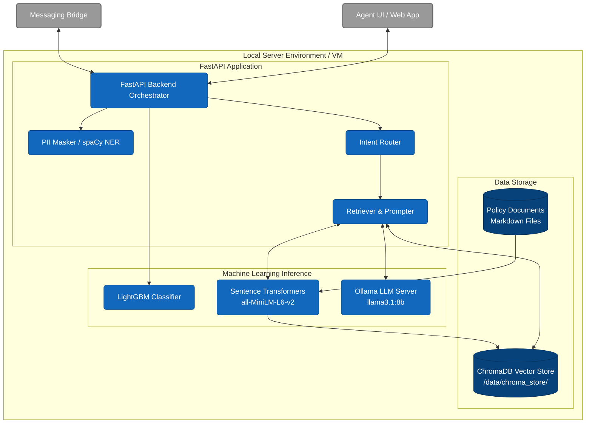

# Cartly Support Copilot - Deployment View

This document contains the Deployment View diagram, mapping the software components to the execution environment and infrastructure.

```mermaid
flowchart TD
    classDef node fill:#f9f9f9,stroke:#333,stroke-width:2px,color:#000,rx:5px,ry:5px
    classDef container fill:#1168bd,color:#fff,stroke:#0b4884,stroke-width:1px,rx:5px,ry:5px
    classDef db fill:#08427b,color:#fff,stroke:#052e56,stroke-width:1px,rx:5px,ry:5px
    classDef external fill:#999999,color:#fff,stroke:#6b6b6b,stroke-width:2px,rx:5px,ry:5px
    
    subgraph LocalEnv [Local Server Environment / VM]
        direction TB
        
        subgraph AppContainer [FastAPI Application]
            api[FastAPI Backend Orchestrator]:::container
            pii[PII Masker / spaCy NER]:::container
            router[Intent Router]:::container
            rag[Retriever & Prompter]:::container
        end
        
        subgraph MLContainer [Machine Learning Inference]
            lgbm[LightGBM Classifier]:::container
            embed[Sentence Transformers\nall-MiniLM-L6-v2]:::container
            ollama[Ollama LLM Server\nllama3.1:8b]:::container
        end
        
        subgraph Storage [Data Storage]
            chroma[(ChromaDB Vector Store\n/data/chroma_store/)]:::db
            mdFiles[(Policy Documents\nMarkdown Files)]:::db
        end
    end
    
    mb[Messaging Bridge]:::external
    ui[Agent UI / Web App]:::external
    
    mb <--> api
    ui <--> api
    
    api --> lgbm
    api --> pii
    api --> router
    router --> rag
    
    rag <--> embed
    rag <--> ollama
    
    embed --> chroma
    chroma <--> rag
    mdFiles --> embed
```
