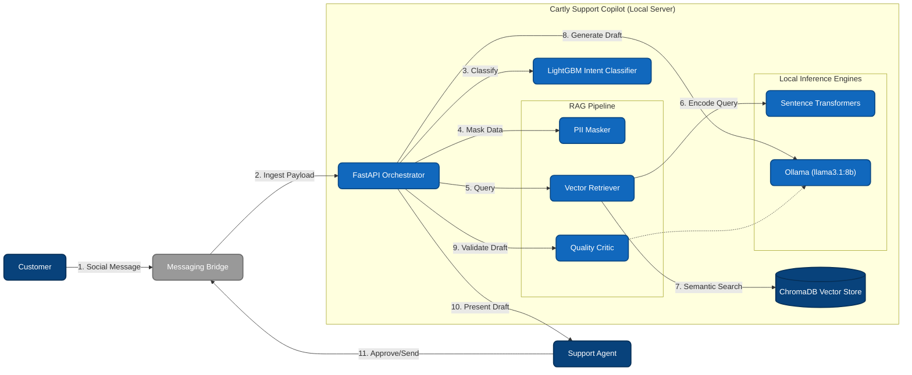

# Cartly Support Copilot - Hybrid Architecture Diagram

This document contains a Hybrid diagram, combining structural components with high-level data and control flow to provide a comprehensive architectural overview.

