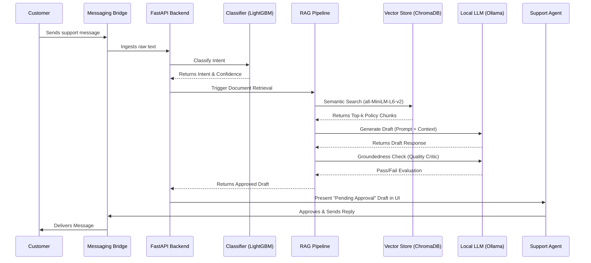

# Cartly Support Copilot - Runtime View

This document contains the Runtime View diagram, illustrating the dynamic sequence of interactions between the user, the messaging bridge, and the internal components during ticket processing.

